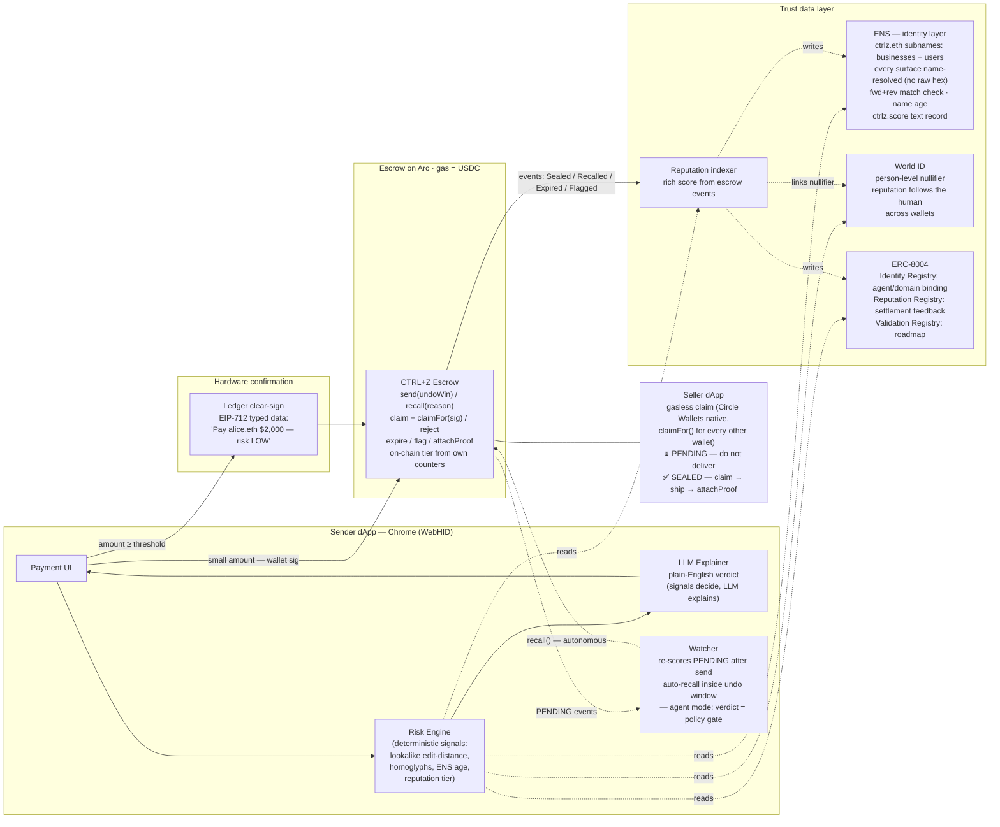
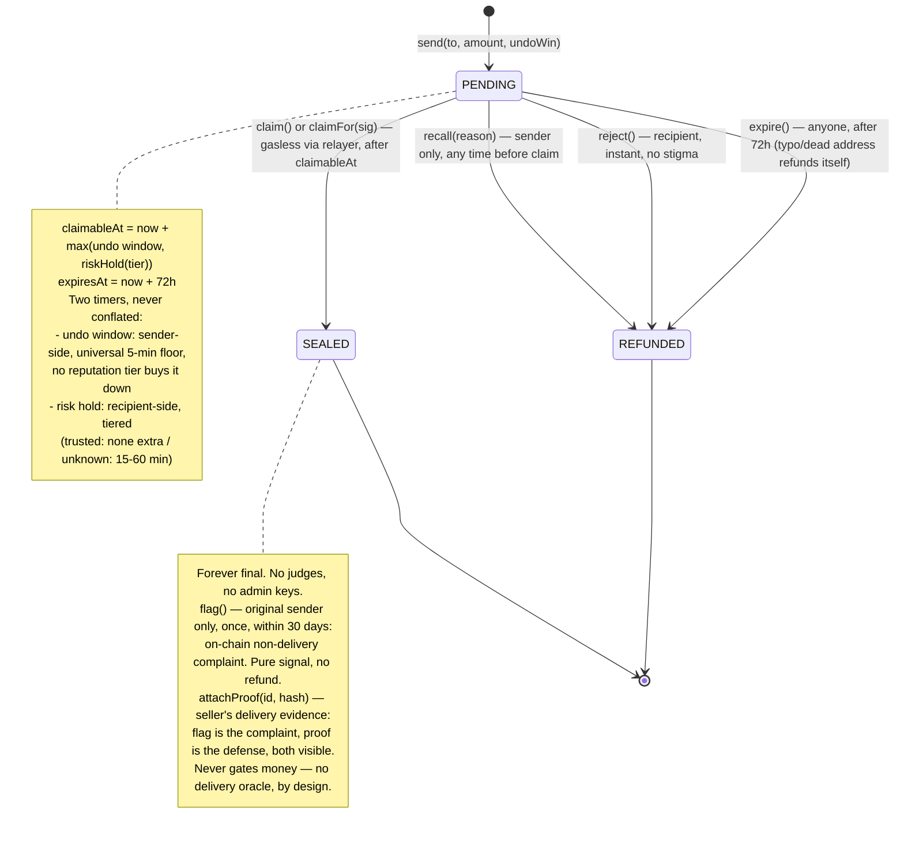
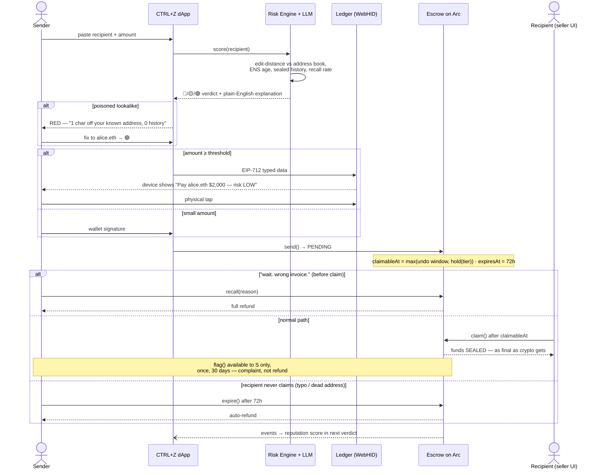
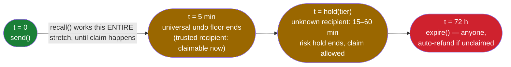

# CTRL+Z — Architecture

See [README.md](README.md) for the full design rationale.

## 1. Big picture

## 2. Escrow state machine

## 3. Payment lifecycle — the three gates end to end

## 4. The two timers

> The 5-min floor is the *guaranteed minimum* undo window; in practice recall
> works for the whole PENDING period — the floor just ensures a recipient's
> auto-claimer can never shrink it to zero.
