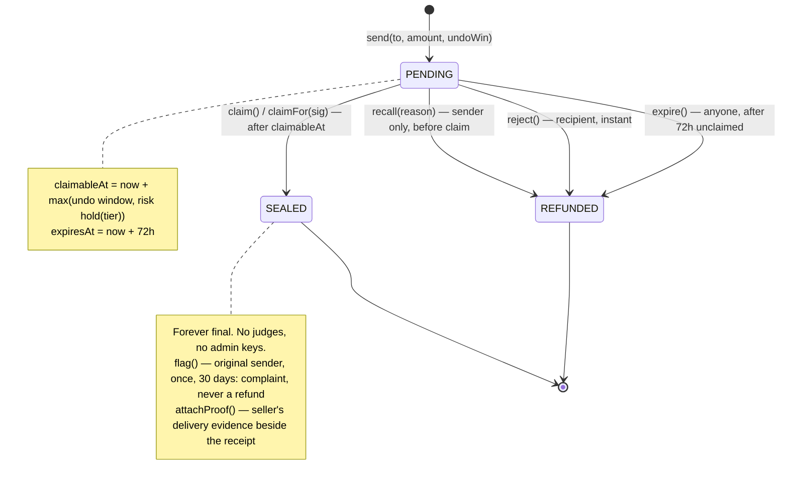
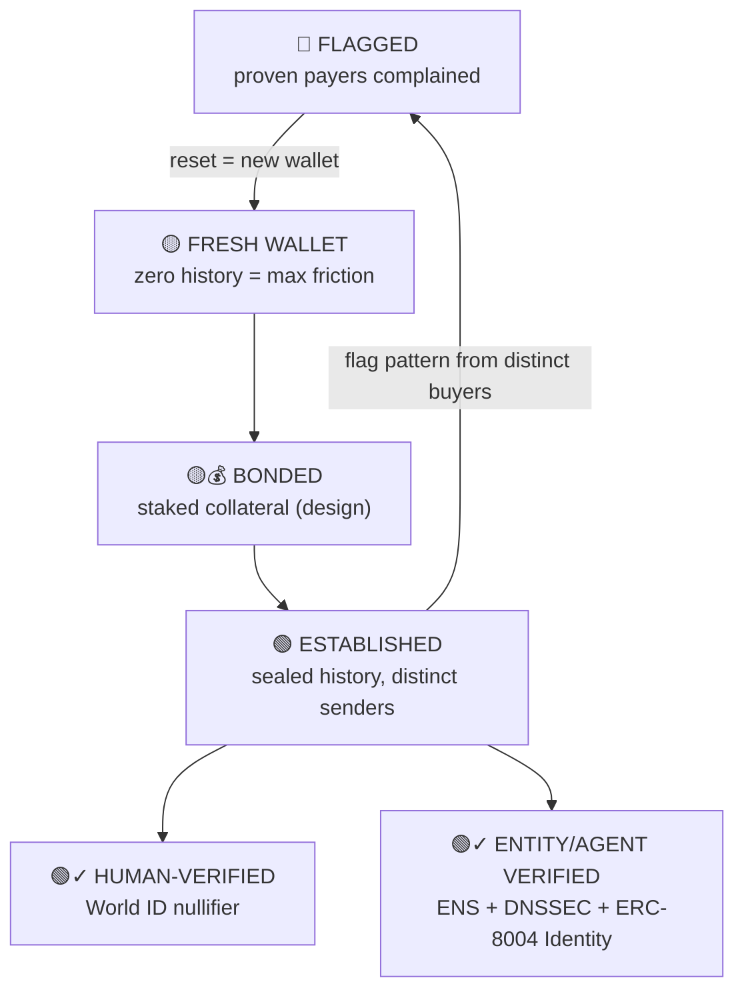

# CTRL+Z — the undo button for money

**Every payment gets an AI bodyguard, a hardware confirmation, and a grace
window you can recall it in — and every settled payment builds on-chain
reputation for both sides.**

Crypto is the only payment rail with no undo, no dispute, and no safety net.
CTRL+Z adds a sender-controlled grace window, a risk copilot, and a
settlement-derived trust layer on top of USDC payments — without arbiters,
admin keys, or anyone else ever touching the money.

> By the author of TrustMCP (HackMoney 2026); all code in this repo was
> written at ETHGlobal New York 2026.

---

## The problem

- Address poisoning: **~270M attack attempts, 17M victims, $83.8M+ confirmed
  losses** (CMU CyLab / USENIX Security study, July 2022–June 2024, Ethereum +
  BSC only — an undercount).
- It's accelerating: **65.4M poisoning transactions flagged since Jan 2025 —
  over 160,000 per day** (Blockaid). In April 2026, ~15,000 lookalike
  addresses were planted directly into Safe{Wallet} UIs.
- In December 2025, one person lost **$49,999,950 USDT in a single paste** —
  after doing a $50 test transaction. The funds went through a mixer in under
  30 minutes.
- The industry's entire answer today is **warnings**. After the warning, the
  money is exactly as gone as before.

## The product — three gates per payment

1. **AI copilot (before send):** deterministic risk signals decide — lookalike
   edit-distance against your address book *and against known names*
   (homoglyph + ENSIP-15 normalization), recipient history, ENS name age,
   forward/reverse resolution match, reputation tier — and an LLM explains the
   verdict in plain English.
2. **Hardware clear-sign (for large amounts):** a Ledger displays the
   human-readable verdict — *"Pay alice.eth $2,000 — risk LOW"* — not blind
   hex. Physical tap to approve.
3. **Escrow grace window (after send):** money sits PENDING and recallable
   until the recipient claims. Every payment carries a universal **5-minute
   undo window** (think Gmail undo-send), unknown recipients face a longer
   risk hold, and unclaimed money refunds itself automatically.

**Scope, deliberately:** we protect the **send**, not the shopping. After a
claim seals a payment, it is as final as crypto has ever been.

## How it works

### State machine

```
send(to, amount, undoWin) → PENDING  claimableAt = now + max(undoWin, hold(tier))
                                     undoWin sender-chosen, clamped [5 min, 24 h]
                                     expiresAt   = now + 72 h
recall(reason)   sender only, while PENDING          → REFUNDED
                 reason: WRONG_ADDRESS | WRONG_AMOUNT | FRAUD_SUSPECTED | OTHER
claim() /
claimFor(id,sig) recipient — or any relayer carrying  → SEALED (forever final)
                 the recipient's signature (gasless claim)
reject()         recipient, while PENDING, instant    → REFUNDED (no stigma)
expire()         anyone, after expiresAt unclaimed    → auto-refund to sender
flag(id)         original sender of a SEALED payment, once, within 30 days
                 → on-chain "paid but not delivered" complaint (signal, never a refund)
attachProof(id,hash)  seller, on a SEALED payment → delivery evidence
                 (tracking hash/URI). Signal only — never gates money.
```

The recipient's hold time (`hold(tier)`) is **computed on-chain from the
contract's own per-address counters** (sealed count, distinct senders, flags,
first seen). No oracle, no off-chain trust: the escrow *is* the reputation
system, literally, at the contract level.

### Two timers, never conflated

- **Undo window (sender-side, universal):** minimum 5 minutes on *every*
  payment, regardless of recipient reputation. Without it, a trusted seller's
  auto-claimer would shrink the undo to zero exactly when the most money moves.
- **Risk hold (recipient-side, tiered):** stacks on top via `max()`. Trusted
  recipients add nothing; first-time/unknown recipients wait 15–60 minutes —
  the window where the AI verdict, the human "oh no," and auto-recall do
  their work.



## The reputation loop (the actual product)

The escrow is the sensor and the actuator; the product is the loop:
**settlement events → money-backed reputation → reputation sets the next
payment's friction.**

Raw feed = escrow events: `Sealed`, `Recalled(reason)`, `Expired`, `Flagged`.
Money-backed events, not reviews:

- Sealed claims **weighted by distinct senders** build trust; flags from
  distinct proven payers, weighted by amount, burn it.
- `claim()` is the receipt; `flag()` is the complaint — and the sealed payment
  gives it standing. Only someone who provably paid can complain, once.
  `attachProof()` is the seller's defense. Future buyers see both sides.
- Recalls are split by reason code: `FRAUD_SUSPECTED` recalls act as a
  pre-claim early-warning signal; innocent fat-finger recalls don't unfairly
  ding sellers.
- **Reviewer credibility — we score the scorers:** flags and fraud-recalls are
  weighted by the signaler's track record. Early detectors gain influence;
  serial lone-flaggers decay toward zero. Accuracy earns *influence, never
  money* — there is no profit in lying.
- Unsolicited PENDING payments never count toward history or score — only
  claimed payments do (you can't dust-poison the anti-poisoning system).
- Two-sided: serial recallers earn their own buyer-side warning.

### Identity vs. reputation

Verification is the passport; reputation is the driving record.

- **Wallet:** behavioral signal, but disposable — fresh wallets get maximum
  friction until they prove themselves. Resetting escapes bad reputation only
  by descending to the bottom of the ladder, never sideways.
- **Human:** a World ID nullifier binds wallets to a person — a fresh wallet
  re-verifies to the *same* nullifier, so flags follow the human.
- **Entity / agent:** DNSSEC→ENS and the ERC-8004 Identity Registry let a
  brand *import* identity ("a fake Walmart agent can register a name, but it
  cannot prove control of walmart.com"). Verified entities still build
  behavioral reputation — verification makes reputation *more* binding,
  because verified identities can't wallet-reset away from their record.



### Where reputation lives

- **ENS text record** (`ctrlz.score`) on the recipient's name — any wallet
  anywhere can resolve it.
- **ERC-8004 Reputation Registry** — settlement-derived (money-backed)
  feedback for seller agents, rather than attestation-only feedback.

## ENS is the identity layer, not a feature

Address poisoning exists because humans can't read hex — so the UI never
shows hex. Every surface resolves names: recipient field, verdict, Ledger
screen, seller dashboard, event feed, flag records. Forward + reverse
resolution must match. Businesses and users get `*.ctrlz.eth` subnames; trust
data rides the name as a text record.

And because names can be poisoned too (`aIice.eth`, Cyrillic homoglyphs), the
risk engine runs the same lookalike checks on names as on addresses, plus
ENSIP-15 normalization and name age.

## Built for humans and agents

The contract is agent-agnostic; policy lives in the client.

- **Agent as sender:** the verdict is a policy gate, not a popup — green and
  under-limit, the agent pays autonomously; large or unknown, it escalates to
  a human's Ledger for clear-signed approval.
- **Auto-recall:** the watcher keeps re-scoring PENDING payments *after*
  send. If a flag lands mid-window, it recalls by itself — the undo button
  works while you sleep.
- **Agent as seller:** auto-claim at `claimableAt` (made safe by the
  universal undo floor), ERC-8004 identity, delivery proof via shipping-API
  webhook (roadmap).

## Why Arc

- **USDC is the gas token** — a one-asset UX. Buyers pay fees in the dollars
  they're already sending, and a brand-new seller can claim a payment with a
  completely empty wallet (`claimFor` covers any wallet via relayer; Circle
  Wallets makes it native).
- **Deterministic finality** — "SEALED is forever" without a reorg asterisk.
- **Predictable, cent-level fees in dollar terms** — every protected payment
  is 2+ transactions; the bodyguard must cost less than the mugging risk.

We also read Circle's open-source Refund Protocol closely. It shares the
risk-tiered lockup idea — but its lockups are assigned by an arbiter, and its
payer has no post-payment rights. CTRL+Z inverts both: tiers are derived
on-chain from settlement history, and the *sender* holds the only undo right,
only before claim. Its `refundTo`-locked-at-pay pattern informed our design:
refunds here can only ever return to the original sender, fixed at `send()`.

## Design decisions we made on purpose

- **No arbiters, no admin keys, ever.** Sealed payments cannot be touched by
  anyone. It's not reversible money — it's money with a grace period.
- **Delivery proof never gates money.** Proof-conditioned release would make
  a shipping API an oracle with control over funds. Evidence sits beside the
  receipt; it is not a key to the vault.
- **No partial-seal / vesting** — that turns a payment-safety layer into a
  goods escrow, which is a different (and arbiter-shaped) product.
- **Flags are burn-only signals** — paying flaggers would create a
  false-flag profit motive.

## Prior art

| Who | What they do | What they don't |
|---|---|---|
| Trust Wallet / Blockaid / Trezor | Warn about poisoning | No recall, no reputation |
| Stanford ERC-20R (2022) | Reversals via judge panel | Third parties control money; never shipped |
| Kirobo (2021) | Retrievable transfers via one-time code | No risk engine, no reputation, no poisoning defense |
| RebelFi | Escrow with amount-sized cancellation windows | No reputation, no AI verdict |
| Peanut Protocol | Claim links, sender reclaim | Gifting framing: no risk tiers, no reputation |
| Circle Refund Protocol | Non-custodial escrow + refunds | Arbiter-mediated; no sender-only undo, no reputation loop |
| ERC-8004 ecosystem | Agent identity + feedback registries | Feedback is attestations, not money-backed |
| **CTRL+Z** | Sender-only grace window + settlement-derived reputation + AI verdict + hardware clear-sign | Goods disputes — deliberately |

People keep building the undo button. Nobody built the credit score behind
it — or made the vault door's speed depend on it.

## Status

<!-- UPDATE THIS SECTION BEFORE FINAL SUBMISSION — list only what actually
     shipped. Move anything unfinished down to Roadmap. -->

Built solo in 36 hours at ETHGlobal New York 2026. Implemented: escrow
contract on Arc testnet (send / recall / claim+claimFor / reject / expire /
flag / attachProof, on-chain tiers), risk engine, LLM explainer, Ledger
clear-signing, buyer + seller dApps, ENS resolution on every surface.
Designed but not implemented this weekend: seller bonds with capped slashing,
World ID nullifier binding, ERC-8004 registry writes, reviewer-credibility
weighting in the indexer.

## Roadmap

"Pay with CTRL+Z" marketplace embed · ERC-8004 Reputation Registry writes ·
World ID person-binding · risk-verdict-as-a-service for agents (x402
nanopayments) · cross-chain pay-in via CCTP · EURC support.
